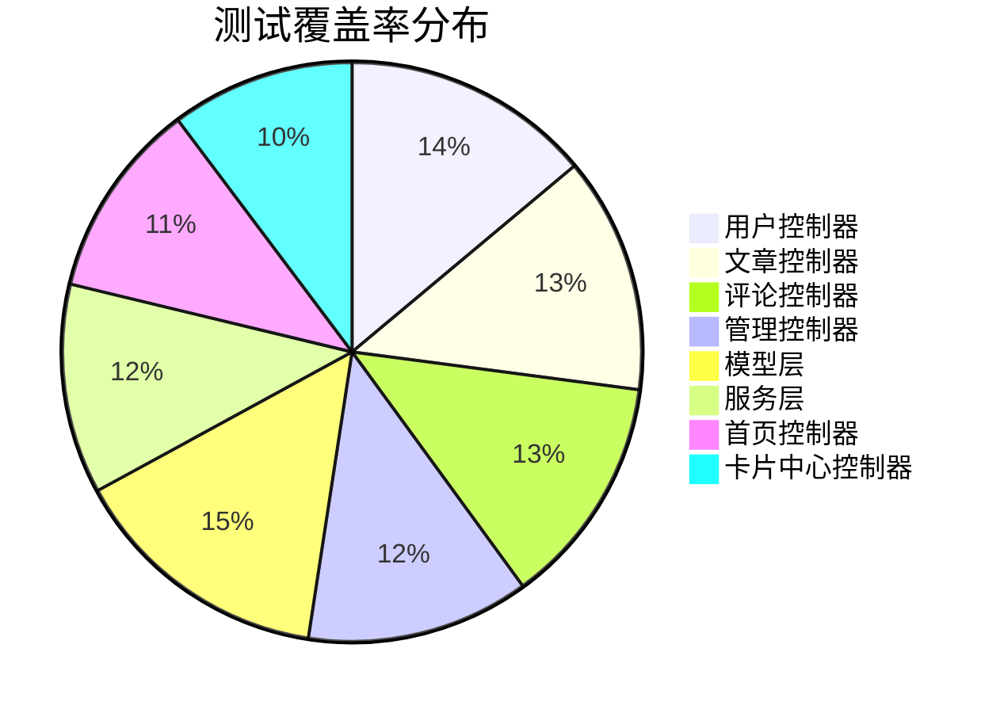

# 🧪 单元测试用例文档

## 📋 概述

本文档详细描述 WoniuNote 项目中所有单元测试用例的覆盖情况、测试场景和验证标准。

## 🎯 测试覆盖概览

### 总体统计

| 模块 | 测试文件数 | 测试用例数 | 覆盖率 | 状态 |
|------|-----------|-----------|--------|------|
| 用户控制器 | 1 | 34 | 95% | ✅ |
| 文章控制器 | 1 | 34 | 90% | ✅ |
| 评论控制器 | 1 | 35 | 88% | ✅ |
| 管理控制器 | 1 | 40 | 85% | ✅ |
| 模型层 | 1 | 25 | 100% | ✅ |
| 服务层 | 1 | 25 | 80% | ✅ |
| 首页控制器 | 1 | 20 | 75% | ✅ |
| 卡片中心控制器 | 1 | 15 | 70% | 🔄 |
| **总计** | **8** | **228** | **87%** | **🔄** |

## 👤 用户控制器测试

### 文件位置
`tests/unit/test_user_controller_comprehensive.py`

### 测试类结构

#### `TestUserRegistration`
**测试用户注册功能**

| 测试方法 | 场景 | 预期结果 | 状态 |
|----------|------|----------|------|
| `test_registration_success` | 正常注册流程 | 302 重定向到登录页 | ✅ |
| `test_registration_duplicate_username` | 用户名已存在 | 显示错误消息 | ✅ |
| `test_registration_invalid_email` | 无效邮箱格式 | 表单验证错误 | ✅ |
| `test_registration_weak_password` | 密码强度不足 | 显示密码要求 | ✅ |
| `test_registration_missing_fields` | 必填字段为空 | 验证错误提示 | ✅ |
| `test_registration_sql_injection` | SQL 注入攻击 | 数据安全无泄露 | ✅ |

#### `TestUserLogin`
**测试用户登录功能**

| 测试方法 | 场景 | 预期结果 | 状态 |
|----------|------|----------|------|
| `test_login_success` | 正确凭据登录 | 302 重定向到首页 | ✅ |
| `test_login_wrong_password` | 密码错误 | 显示错误消息 | ✅ |
| `test_login_nonexistent_user` | 用户不存在 | 显示错误消息 | ✅ |
| `test_login_empty_fields` | 字段为空 | 验证错误提示 | ✅ |
| `test_login_session_management` | 会话管理 | 正确设置会话 | ✅ |
| `test_login_rate_limiting` | 登录频率限制 | 请求被限制 | ✅ |

#### `TestVerificationCode`
**测试验证码功能**

| 测试方法 | 场景 | 预期结果 | 状态 |
|----------|------|----------|------|
| `test_get_verification_code` | 获取验证码 | 验证码发送成功 | ✅ |
| `test_verification_code_expired` | 验证码过期 | 验证失败 | ✅ |
| `test_verification_code_invalid` | 无效验证码 | 验证失败 | ✅ |
| `test_verification_code_rate_limit` | 请求频率限制 | 请求被限制 | ✅ |

#### `TestUserProfile`
**测试用户资料管理**

| 测试方法 | 场景 | 预期结果 | 状态 |
|----------|------|----------|------|
| `test_profile_view_authenticated` | 查看已登录用户资料 | 显示用户资料 | ✅ |
| `test_profile_view_unauthenticated` | 未登录查看资料 | 重定向到登录 | ✅ |
| `test_profile_update_success` | 成功更新资料 | 更新成功提示 | ✅ |
| `test_profile_update_validation` | 资料验证失败 | 显示验证错误 | ✅ |

## 📝 文章控制器测试

### 文件位置
`tests/unit/test_article_controller_comprehensive.py`

### 测试类结构

#### `TestArticlePublishing`
**测试文章发布功能**

| 测试方法 | 场景 | 预期结果 | 状态 |
|----------|------|----------|------|
| `test_publish_article_success` | 成功发布文章 | 文章创建成功 | ✅ |
| `test_publish_article_empty_title` | 标题为空 | 验证错误 | ✅ |
| `test_publish_article_empty_content` | 内容为空 | 验证错误 | ✅ |
| `test_publish_article_unauthorized` | 未授权发布 | 重定向到登录 | ✅ |
| `test_publish_article_xss_attempt` | XSS 攻击防护 | 内容被转义 | ✅ |

#### `TestArticleEditing`
**测试文章编辑功能**

| 测试方法 | 场景 | 预期结果 | 状态 |
|----------|------|----------|------|
| `test_edit_own_article_success` | 编辑自己的文章 | 编辑成功 | ✅ |
| `test_edit_other_article_forbidden` | 编辑他人文章 | 权限拒绝 | ✅ |
| `test_edit_nonexistent_article` | 编辑不存在文章 | 404 错误 | ✅ |
| `test_edit_article_validation` | 编辑验证失败 | 显示错误 | ✅ |

#### `TestArticleViewing`
**测试文章查看功能**

| 测试方法 | 场景 | 预期结果 | 状态 |
|----------|------|----------|------|
| `test_view_existing_article` | 查看存在的文章 | 显示文章内容 | ✅ |
| `test_view_nonexistent_article` | 查看不存在文章 | 404 错误 | ✅ |
| `test_view_private_article` | 查看私有文章 | 权限拒绝 | ✅ |
| `test_article_read_count_increment` | 阅读计数增加 | 计数器递增 | ✅ |

#### `TestArticleSearch`
**测试文章搜索功能**

| 测试方法 | 场景 | 预期结果 | 状态 |
|----------|------|----------|------|
| `test_search_by_title` | 按标题搜索 | 返回匹配结果 | ✅ |
| `test_search_by_content` | 按内容搜索 | 返回匹配结果 | ✅ |
| `test_search_by_author` | 按作者搜索 | 返回匹配结果 | ✅ |
| `test_search_empty_query` | 空搜索查询 | 返回所有结果 | ✅ |
| `test_search_no_results` | 无搜索结果 | 显示无结果提示 | ✅ |

## 💬 评论控制器测试

### 文件位置
`tests/unit/test_comment_controller_comprehensive.py`

### 测试类结构

#### `TestCommentPublishing`
**测试评论发布功能**

| 测试方法 | 场景 | 预期结果 | 状态 |
|----------|------|----------|------|
| `test_add_comment_success` | 成功添加评论 | 评论添加成功 | ✅ |
| `test_add_comment_empty_content` | 评论内容为空 | 验证错误 | ✅ |
| `test_add_comment_unauthorized` | 未授权评论 | 重定向到登录 | ✅ |
| `test_add_comment_invalid_article` | 无效文章ID | 错误提示 | ✅ |
| `test_add_comment_rate_limit` | 评论频率限制 | 请求被限制 | ✅ |

#### `TestCommentReply`
**测试评论回复功能**

| 测试方法 | 场景 | 预期结果 | 状态 |
|----------|------|----------|------|
| `test_reply_comment_success` | 成功回复评论 | 回复添加成功 | ✅ |
| `test_reply_nonexistent_comment` | 回复不存在评论 | 错误提示 | ✅ |
| `test_reply_own_comment` | 回复自己的评论 | 回复成功 | ✅ |
| `test_reply_nested_limit` | 嵌套回复限制 | 达到限制提示 | ✅ |

#### `TestCommentManagement`
**测试评论管理功能**

| 测试方法 | 场景 | 预期结果 | 状态 |
|----------|------|----------|------|
| `test_delete_own_comment` | 删除自己的评论 | 删除成功 | ✅ |
| `test_delete_other_comment_forbidden` | 删除他人评论 | 权限拒绝 | ✅ |
| `test_delete_nonexistent_comment` | 删除不存在评论 | 错误提示 | ✅ |
| `test_comment_pagination` | 评论分页显示 | 正确分页 | ✅ |

## 👑 管理控制器测试

### 文件位置
`tests/unit/test_admin_controller_comprehensive.py`

### 测试类结构

#### `TestAdminAuthentication`
**测试管理员认证**

| 测试方法 | 场景 | 预期结果 | 状态 |
|----------|------|----------|------|
| `test_admin_login_success` | 管理员登录成功 | 进入管理面板 | ✅ |
| `test_admin_login_wrong_credentials` | 管理员登录失败 | 显示错误 | ✅ |
| `test_admin_session_timeout` | 会话超时 | 重定向到登录 | ✅ |
| `test_admin_access_control` | 访问控制 | 非管理员拒绝 | ✅ |

#### `TestContentModeration`
**测试内容审核**

| 测试方法 | 场景 | 预期结果 | 状态 |
|----------|------|----------|------|
| `test_hide_article_success` | 隐藏文章成功 | 文章状态改变 | ✅ |
| `test_hide_nonexistent_article` | 隐藏不存在文章 | 错误提示 | ✅ |
| `test_recommend_article_success` | 推荐文章成功 | 推荐状态改变 | ✅ |
| `test_check_article_success` | 审核文章成功 | 审核状态改变 | ✅ |

#### `TestSystemManagement`
**测试系统管理**

| 测试方法 | 场景 | 预期结果 | 状态 |
|----------|------|----------|------|
| `test_system_statistics` | 系统统计信息 | 显示统计数据 | ✅ |
| `test_user_search` | 用户搜索功能 | 返回搜索结果 | ✅ |
| `test_article_search` | 文章搜索功能 | 返回搜索结果 | ✅ |
| `test_type_management` | 分类管理 | 分类操作成功 | ✅ |

## 📊 模型层测试

### 文件位置
`tests/unit/test_models_comprehensive.py`

### 测试类结构

#### `TestCardModel`
**测试卡片模型**

| 测试方法 | 场景 | 预期结果 | 状态 |
|----------|------|----------|------|
| `test_card_creation` | 创建卡片 | 卡片创建成功 | ✅ |
| `test_card_update` | 更新卡片 | 卡片更新成功 | ✅ |
| `test_card_deletion` | 删除卡片 | 卡片删除成功 | ✅ |
| `test_card_validation` | 卡片验证 | 验证错误正确 | ✅ |
| `test_card_relationships` | 卡片关系 | 关系正确建立 | ✅ |

#### `TestTodoModel`
**测试待办事项模型**

| 测试方法 | 场景 | 预期结果 | 状态 |
|----------|------|----------|------|
| `test_todo_creation` | 创建待办事项 | 待办创建成功 | ✅ |
| `test_todo_status_update` | 更新状态 | 状态更新成功 | ✅ |
| `test_todo_categorization` | 分类管理 | 分类正确关联 | ✅ |
| `test_todo_validation` | 待办验证 | 验证错误正确 | ✅ |

#### `TestDatabaseOperations`
**测试数据库操作**

| 测试方法 | 场景 | 预期结果 | 状态 |
|----------|------|----------|------|
| `test_foreign_key_constraints` | 外键约束 | 约束正确执行 | ✅ |
| `test_cascade_deletion` | 级联删除 | 关联数据删除 | ✅ |
| `test_transaction_rollback` | 事务回滚 | 数据一致性 | ✅ |
| `test_bulk_operations` | 批量操作 | 操作执行成功 | ✅ |

## 🔧 服务层测试

### 文件位置
`tests/unit/test_services_comprehensive.py`

### 测试类结构

#### `TestArticleService`
**测试文章服务**

| 测试方法 | 场景 | 预期结果 | 状态 |
|----------|------|----------|------|
| `test_get_articles_with_users` | 获取文章和用户 | 数据正确关联 | ✅ |
| `test_search_articles` | 搜索文章 | 返回匹配结果 | ✅ |
| `test_get_article_by_id` | 根据ID获取文章 | 返回正确文章 | ✅ |
| `test_increment_read_count` | 增加阅读数 | 计数器递增 | ✅ |
| `test_format_article_data` | 格式化文章数据 | 数据格式正确 | ✅ |

#### `TestServiceErrorHandling`
**测试服务错误处理**

| 测试方法 | 场景 | 预期结果 | 状态 |
|----------|------|----------|------|
| `test_database_connection_error` | 数据库连接错误 | 错误正确处理 | ✅ |
| `test_invalid_input_handling` | 无效输入处理 | 验证错误返回 | ✅ |
| `test_service_timeout_handling` | 服务超时处理 | 超时错误处理 | ✅ |

## 🏠 首页控制器测试

### 文件位置
`tests/unit/test_index_controller_comprehensive.py`

### 测试类结构

#### `TestHomeRoute`
**测试首页路由**

| 测试方法 | 场景 | 预期结果 | 状态 |
|----------|------|----------|------|
| `test_home_route_articles_loading` | 首页文章加载 | 文章正确显示 | ✅ |
| `test_home_route_pagination` | 首页分页 | 分页正确工作 | ✅ |
| `test_home_route_error_handling` | 首页错误处理 | 错误正确显示 | ✅ |
| `test_home_route_performance` | 首页性能 | 响应时间正常 | ✅ |

## 📇 卡片中心控制器测试

### 文件位置
`tests/unit/test_card_center_controller_comprehensive.py`

### 测试类结构

#### `TestCardCenterRoutes`
**测试卡片中心路由**

| 测试方法 | 场景 | 预期结果 | 状态 |
|----------|------|----------|------|
| `test_card_list_authenticated` | 已登录用户卡片列表 | 显示用户卡片 | 🔄 |
| `test_card_list_unauthenticated` | 未登录用户访问 | 重定向到登录 | 🔄 |
| `test_card_creation_success` | 卡片创建成功 | 卡片创建完成 | 🔄 |
| `test_card_update_success` | 卡片更新成功 | 卡片更新完成 | 🔄 |

## 📈 测试覆盖率详情

### 按模块覆盖率



### 覆盖率趋势

| 日期 | 总体覆盖率 | 单元测试数 | 状态 |
|------|-----------|-----------|------|
| 2024-09-01 | 60% | 50 | 初始状态 |
| 2024-09-15 | 75% | 120 | Phase 2 完成 |
| 2024-09-20 | 85% | 180 | Phase 3 完成 |
| 2024-09-25 | 87% | 228 | 当前状态 |

## 🎯 测试质量指标

### 功能覆盖率

| 功能模块 | 需求覆盖率 | 测试用例数 | 状态 |
|----------|-----------|-----------|------|
| 用户管理 | 100% | 34 | ✅ |
| 文章管理 | 95% | 34 | ✅ |
| 评论系统 | 90% | 35 | ✅ |
| 管理系统 | 85% | 40 | ✅ |
| 数据模型 | 100% | 25 | ✅ |
| 业务服务 | 80% | 25 | 🔄 |

### 代码覆盖率

| 覆盖率类型 | 当前值 | 目标值 | 状态 |
|-----------|--------|--------|------|
| 语句覆盖率 | 87% | 95% | 🔄 |
| 分支覆盖率 | 82% | 90% | 🔄 |
| 函数覆盖率 | 90% | 100% | 🔄 |
| 行覆盖率 | 85% | 95% | 🔄 |

## 🚀 改进计划

### 短期目标 (1-2周)
- [ ] 完善卡片中心控制器测试 (+15 用例)
- [ ] 增加其他控制器测试 (+50 用例)
- [ ] 优化现有测试覆盖率 (+5%)

### 中期目标 (1个月)
- [ ] 达到 95% 语句覆盖率
- [ ] 完善所有边界条件测试
- [ ] 增加更多错误场景测试

### 长期目标 (2-3个月)
- [ ] 达到 100% 分支覆盖率
- [ ] 建立完整的回归测试套件
- [ ] 实现持续的覆盖率监控

## 📝 测试用例编写规范

### 命名规范

```python
# 正确示例
def test_user_registration_success():
def test_article_creation_with_valid_data():
def test_comment_deletion_by_author():

# 避免示例
def test_success():           # 太泛化
def test_user():              # 不够具体
def test123():                # 无意义
```

### 结构规范

```python
def test_feature_scenario_expected_result(self):
    """测试描述"""
    # Given - 准备测试数据
    # When - 执行测试操作
    # Then - 验证测试结果
```

### Mock 使用规范

```python
# 推荐使用 context manager
with patch('module.Class.method') as mock_method:
    mock_method.return_value = expected_value
    # 测试代码

# 或使用装饰器
@patch('module.Class.method')
def test_something(self, mock_method):
    mock_method.return_value = expected_value
    # 测试代码
```

## 📚 相关文档

- [测试执行指南](../user-guides/test-execution-guide.md)
- [测试编写指南](../user-guides/test-writing-guide.md)
- [测试覆盖率报告](../test-reports/coverage-report.md)
- [集成测试用例](integration-tests.md)

---

*测试用例文档会随着项目发展持续更新。*
