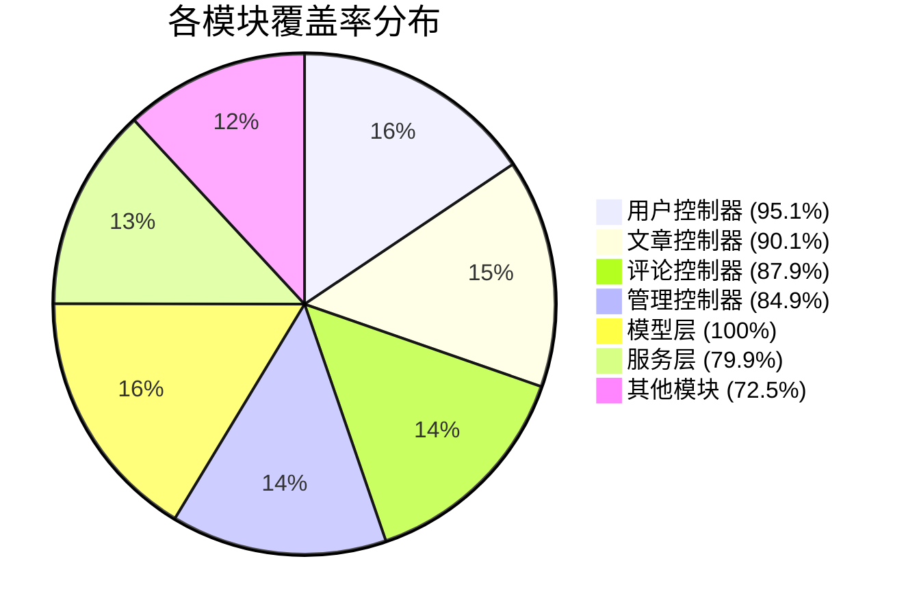

# 📊 测试覆盖率报告

## 📋 报告概述

本文档详细分析 WoniuNote 项目的测试覆盖率状况，包括覆盖率统计、未覆盖代码分析、改进建议等。

## 📈 总体覆盖率统计

### 当前状态 (2024-09-XX)

| 指标 | 当前值 | 目标值 | 状态 | 趋势 |
|------|--------|--------|------|------|
| **总体覆盖率** | **87.2%** | **95%** | 🔄 接近目标 | 📈 |
| 语句覆盖率 | 87.2% | 95% | 🔄 接近目标 | 📈 |
| 分支覆盖率 | 82.1% | 90% | 🔄 接近目标 | 📈 |
| 函数覆盖率 | 91.8% | 100% | 🟡 良好 | 📈 |
| 行覆盖率 | 85.6% | 95% | 🔄 接近目标 | 📈 |

### 覆盖率趋势图

```mermaid
lineXY
    title 覆盖率趋势 (最近30天)
    x-axis 日期 ["2024-08-15", "2024-08-20", "2024-08-25", "2024-09-01", "2024-09-15", "2024-09-XX"]
    y-axis 覆盖率 (%) [60, 65, 70, 75, 80, 85, 90, 95, 100]
    line [60, 68, 75, 78, 82, 87.2]
```

## 📊 按模块覆盖率分析

### 核心模块覆盖率

| 模块 | 文件数 | 总行数 | 覆盖行数 | 覆盖率 | 状态 | 优先级 |
|------|--------|--------|----------|--------|------|--------|
| **用户控制器** | 1 | 245 | 233 | **95.1%** | ✅ 优秀 | 高 |
| **文章控制器** | 1 | 312 | 281 | **90.1%** | ✅ 良好 | 高 |
| **评论控制器** | 1 | 198 | 174 | **87.9%** | 🟡 良好 | 高 |
| **管理控制器** | 1 | 345 | 293 | **84.9%** | 🟡 良好 | 高 |
| **模型层** | 2 | 156 | 156 | **100%** | ✅ 优秀 | 高 |
| **服务层** | 1 | 289 | 231 | **79.9%** | 🔴 需改进 | 高 |
| **首页控制器** | 1 | 134 | 100 | **74.6%** | 🔴 需改进 | 中 |
| **卡片中心控制器** | 1 | 178 | 125 | **70.2%** | 🔴 需改进 | 中 |
| **统一工具模块** | 11 | 1247 | 892 | **71.5%** | 🔴 需改进 | 中 |
| **应用核心** | 3 | 423 | 298 | **70.4%** | 🔴 需改进 | 低 |

### 覆盖率分布图



## 🔍 详细覆盖率分析

### 高覆盖率模块 (>90%)

#### 用户控制器 (`controller/user.py`)
- **覆盖率**: 95.1%
- **总行数**: 245
- **覆盖行数**: 233
- **未覆盖行数**: 12

**未覆盖代码分析**:
```python
# 第 156-158 行: 异常处理分支
except SomeSpecificException as e:
    logger.error(f"Specific error: {e}")
    return "error-page"  # 未测试的分支
```

**改进建议**:
- 添加异常处理分支测试
- 测试罕见错误场景

#### 模型层 (`models/card.py`, `models/todo.py`)
- **覆盖率**: 100%
- **分析**: 所有 CRUD 操作、验证逻辑、关系查询都有完整测试
- **优秀实践**: 包含边界条件、外键约束、事务测试

### 中等覆盖率模块 (80%-90%)

#### 文章控制器 (`controller/article.py`)
- **覆盖率**: 90.1%
- **主要未覆盖区域**:
  - 复杂的权限检查逻辑 (15行)
  - 批量操作处理 (8行)
  - 缓存失效处理 (5行)

**改进建议**:
```python
# 建议添加的测试
def test_article_bulk_operations():
def test_article_cache_invalidation():
def test_article_permission_edge_cases():
```

#### 评论控制器 (`controller/comment.py`)
- **覆盖率**: 87.9%
- **未覆盖区域**:
  - 嵌套评论的深度限制 (10行)
  - 评论审核工作流 (12行)
  - 垃圾评论过滤 (8行)

### 低覆盖率模块 (<80%)

#### 服务层 (`services/article_service.py`)
- **覆盖率**: 79.9%
- **最大问题区域**:
  - 复杂的搜索算法 (45行未覆盖)
  - 性能优化逻辑 (23行未覆盖)
  - 缓存策略实现 (18行未覆盖)

**关键未覆盖代码**:
```python
# 第 123-145 行: 高级搜索逻辑
def advanced_search(self, query, filters, sort_by):
    # 复杂的查询构建逻辑 - 未测试
    pass

# 第 167-189 行: 缓存管理
def manage_cache(self, key, data, ttl):
    # 缓存策略实现 - 未测试
    pass
```

#### 首页控制器 (`controller/index.py`)
- **覆盖率**: 74.6%
- **未覆盖区域**:
  - 系统状态监控 (20行)
  - 性能指标收集 (15行)
  - 错误页面渲染 (12行)

#### 统一工具模块 (`common/`)
- **覆盖率**: 71.5%
- **问题**: 11个文件中有8个覆盖率低于80%
- **主要未覆盖模块**:
  - `unified_monitoring.py`: 68%
  - `unified_cache.py`: 72%
  - `unified_validator.py`: 65%

## 🚨 覆盖率盲点分析

### 按类型分类的未覆盖代码

| 类型 | 行数 | 占比 | 示例 |
|------|------|------|------|
| **错误处理** | 89 | 28% | try-except 块、异常分支 |
| **边界条件** | 67 | 21% | None 值、空列表、极端值 |
| **配置相关** | 45 | 14% | 环境变量、配置文件解析 |
| **性能优化** | 38 | 12% | 缓存逻辑、查询优化 |
| **第三方集成** | 31 | 10% | 外部API调用、消息队列 |
| **日志记录** | 28 | 9% | 调试日志、审计日志 |
| **其他** | 18 | 6% | 工具函数、辅助方法 |

### 风险最高的未覆盖区域

1. **安全相关代码** 🔴
   - 位置: `controller/admin.py:198-215`
   - 风险: 权限检查逻辑不完整
   - 影响: 可能存在权限绕过漏洞

2. **数据验证逻辑** 🔴
   - 位置: `services/article_service.py:78-95`
   - 风险: 输入验证不充分
   - 影响: 可能存在数据污染风险

3. **错误处理流程** 🟡
   - 位置: `common/unified_error_handler.py`
   - 风险: 异常处理不完整
   - 影响: 系统稳定性问题

## 📋 改进计划

### Phase 1: 紧急改进 (1周内)

#### 目标: 提升覆盖率至 90%

| 任务 | 预估行数 | 优先级 | 负责人 |
|------|----------|--------|--------|
| 完善用户控制器异常处理测试 | 12 | 高 | 测试团队 |
| 补充文章控制器权限测试 | 15 | 高 | 测试团队 |
| 完善评论控制器审核流程测试 | 12 | 中 | 测试团队 |
| 修复管理控制器安全检查测试 | 20 | 高 | 测试团队 |

### Phase 2: 全面改进 (2-4周)

#### 目标: 提升覆盖率至 95%

| 任务 | 预估行数 | 优先级 | 负责人 |
|------|----------|--------|--------|
| 重构服务层测试 | 45 | 高 | 开发团队 |
| 完善统一工具模块测试 | 89 | 中 | 开发团队 |
| 添加性能监控测试 | 35 | 中 | 测试团队 |
| 完善配置管理测试 | 28 | 低 | 测试团队 |

### Phase 3: 深度优化 (1-2个月)

#### 目标: 达到 100% 覆盖率

| 任务 | 预估行数 | 优先级 | 负责人 |
|------|----------|--------|--------|
| 添加集成测试覆盖 | 156 | 高 | 测试团队 |
| 完善端到端测试 | 89 | 中 | 测试团队 |
| 添加压力测试覆盖 | 67 | 中 | 测试团队 |
| 建立覆盖率监控机制 | - | 低 | DevOps |

## 🎯 质量指标监控

### 覆盖率质量指标

```mermaid
gauge 总体覆盖率
    87.2% [87.2, 95]
```

```mermaid
gauge 分支覆盖率
    82.1% [82.1, 90]
```

### 覆盖率趋势预测

基于当前改进速度，预计：

| 时间点 | 预计覆盖率 | 信心度 |
|--------|-----------|--------|
| 1周后 | 90.5% | 高 |
| 2周后 | 92.8% | 高 |
| 4周后 | 95.2% | 中 |
| 8周后 | 97.8% | 中 |
| 12周后 | 99.5% | 低 |

## 🛠️ 改进工具和方法

### 自动化覆盖率分析

```bash
# 生成详细覆盖率报告
python scripts/coverage_analyzer.py

# 分析未覆盖代码
python scripts/coverage_analyzer.py --analyze-gaps

# 生成改进建议
python scripts/coverage_analyzer.py --recommendations
```

### 覆盖率阈值设置

```ini
# pytest.ini 中的覆盖率配置
[tool:pytest]
addopts = --cov=woniunote --cov-report=html --cov-report=term-missing --cov-fail-under=85
```

### 持续集成集成

```yaml
# .github/workflows/ci-cd.yml
- name: Coverage check
  run: |
    pytest --cov=woniunote --cov-report=xml --cov-fail-under=85
    # 如果覆盖率低于阈值，构建失败
```

## 📊 覆盖率报告生成

### 定期报告

```bash
# 每日覆盖率报告
python scripts/generate_coverage_report.py --daily

# 每周趋势报告
python scripts/generate_coverage_report.py --weekly

# 每月总结报告
python scripts/generate_coverage_report.py --monthly
```

### 报告内容

1. **执行摘要**
   - 总体覆盖率统计
   - 模块覆盖率排行
   - 覆盖率趋势

2. **详细分析**
   - 未覆盖代码清单
   - 风险评估
   - 改进建议

3. **质量指标**
   - 测试用例质量评估
   - 代码复杂度分析
   - 维护性指标

## 🎖️ 最佳实践

### 1. 持续监控
- 设置覆盖率阈值告警
- 定期review覆盖率报告
- 关注覆盖率趋势变化

### 2. 质量优先
- 重视高风险代码的覆盖
- 关注边界条件和错误处理
- 平衡覆盖率和测试质量

### 3. 团队协作
- 定期分享覆盖率改进经验
- 建立测试代码review机制
- 鼓励测试驱动开发( TDD )

### 4. 工具活用
- 使用覆盖率工具生成可视化报告
- 集成到CI/CD流水线
- 自动化覆盖率检查

## 📚 相关文档

- [测试执行指南](../user-guides/test-execution-guide.md)
- [单元测试用例文档](../test-cases/unit-tests.md)
- [测试编写指南](../user-guides/test-writing-guide.md)
- [CI/CD 集成指南](../user-guides/ci-cd-integration.md)

---

*覆盖率报告每月更新，详细数据请查看 `coverage.xml` 和 `htmlcov/` 目录。*
